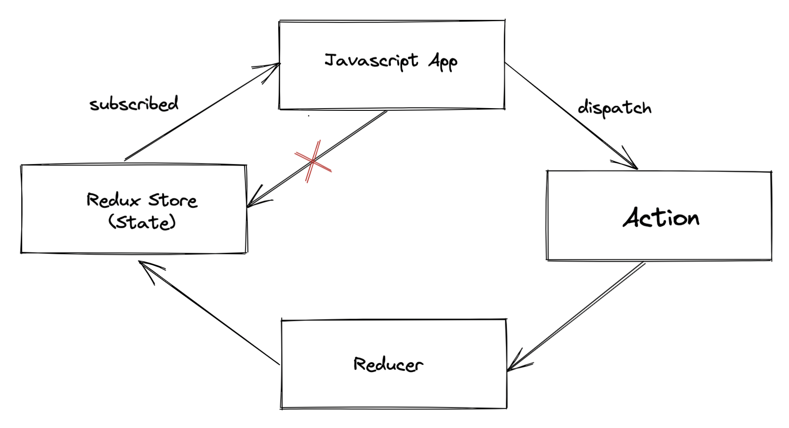

# Basic Redux Note

## See demo result

1. `$ cd /pure-redux/demo`
2. `$ node index.js`

---

## Environment Setting

1. creating a folder for project
2. `$ npm init -y`
3. `$ npm i redux`

## Redux Principle Overview


## Knowledge

- Action type
- Action creater
- Reducer
- Redux Stroe
    - Holds application state
    - Allows access to state via `getState()`
    - Allows state to be update via `dispatch(action)`
    - Registers listeners via `sibscribe(listener)`
    - Handles unregistering of listeners via the function returned by `subscribe(listener)`
- Middleware
- Logging
- Multiple Reducers
- Async Action

## Libraries

- redux-logger
    
    for middleware logging

- redux-thunk

    It allows writing functions with logic inside that can interact with a Redux store's dispatch and getState methods.

- axios

    for fetching the API

## Steps
```
Implementing
- sync: Buy cakes & ice cream
- async: fetching users from `jsonplaceholder`
```

1. Implement Type
    - see: [create cakeType.js](./demo/redux/cake/cakeType.js)
    - the same concept: `iceCreamType.js` & `userType.js`
2. Implement Action
    - see: [create cakeAction.js](./demo/redux/cake/cakeAction.js)
    - the same concept: `iceCreamAction.js` & `userAction.js`
3. Implement Reducer
    - see: [create cakeReducer.js](./demo/redux/cake/cakeReducer.js)
    - the same concept: `iceCreamReducer.js` & `userReducer.js`
4. manage all actions in redux folder
    - see: [create index.js in redux folder](./demo/redux/index.js)
5. manage all reducers in redux folder
    - see: [create rootReducer.js in redux folder](./demo/redux/rootReducer.js)
6. Implement Store & middleware
    - see: [create store.js](./demo/redux/store.js)
    - NOTE: make sure import the `redux-thunk` in the store middleware for dispatching a function
7. execute demo
    - `$ node ./demo/index.js`
    - see: [./demo/index.js](./demo/index.js)
---
- Addtion - subscribe
    - see: [implement subscribe while execute](./demo/index.js)
- Addition - Implement Async Actions Concept
    ### Actions
    1. FETCH_USERS_REQUEST - Fetch list of users
    2. FETCH_USERS_SUCCESS - Fetched successfully
    3. FETCH_USERS_FAILURE - ERROR fetching the data

    ### Reducers
    > case: FETCH_USERS_REQUEST
    > > loading: true
    >
    > case: FETCH_USERS_SUCCESS
    > > loading: false
    > > 
    > > users: data(from API)
    >
    > case: FETCH_USERS_FAILURE
    > > loading: false
    > >
    > > error: error(from API)
