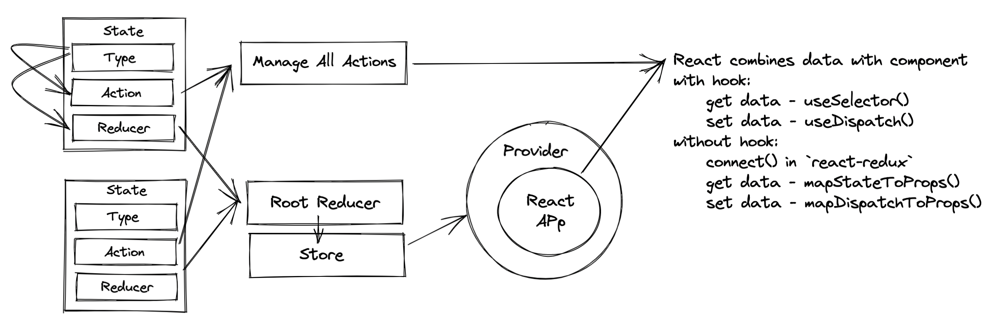
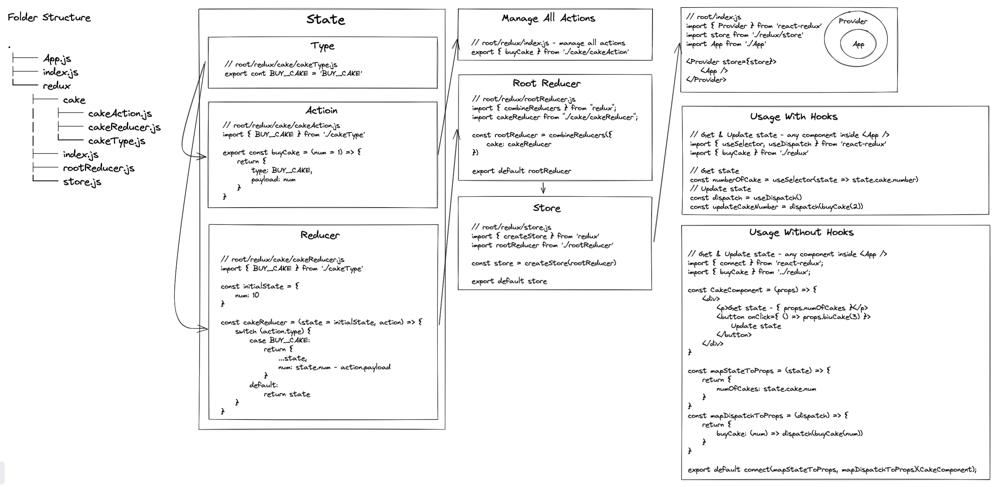

# React-Redux Demo

[readme - Default create-react-app README.md](./create-react-app-readme.md)

## Environment Stting

1. `$ npx create-react-app demo`
2. `$ npm i redux react-redux`

## React-Redux overview

## Libraries from npm

- react
- redux
- react-redux
- redux-logger
- redux-devtools-extension

## Tools

- [link - Redux DevTools: Chrome extension](https://chrome.google.com/webstore/detail/redux-devtools/lmhkpmbekcpmknklioeibfkpmmfibljd?hl=en)
- [link - Redux DevTools: Github](https://github.com/zalmoxisus/redux-devtools-extension)

## Knowledge

- `createStore`( from `redux` )
- `combineReducers`( from `redux` )
- `Provider`( from `react-redux` )
- combining data with component
    - `connect`( from `react-redux` )
        - mapStateToProps( customize function passing to connect() )
        - mapDispatchToProps( customize function passing to connect() )
    - `useSelector` & `useDispatch` ( from `react-redux` )
- `applyMiddleware`( from `redux` )
- Logging
    - `logger`( from `redux-logger` )
    - `Redux DevTools`( Chrome extension )
    - [link - Reference: Redux DevTools tutorial video](https://youtu.be/IlM7497j6LY)

## Steps

1. Create redux stuff: action -> reducer -> store (in `src/redux/{stateName}`)
2. Combining reducers in `/src/redux/rootReducer.js`
2. Adding Provider( from `react-redux` ) in `src/App.js` 
3. Connect state with component in `src/components`
    - without hook: connect(mapStateToProps, mapDispatchToProps) to component
    - with hook: useSelector & useDispatch
4. Additional: logging
    - logging in the middleware( file: `/src/redux/store.js` )
    - logging with Redux Devtool Extension
5. Create reusable components: `/src/components/ItemContainer.jsx`
6. Async Action: `/src/components/UserContainer.jsx`
    - require library: `axios`
    - require library: `redux-thunk`
